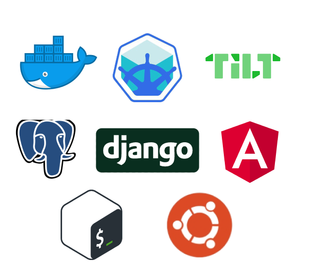

# BitBuyer

- [BitBuyer](#bitbuyer)
  - [Intro](#intro)
  - [Overview](#overview)
  - [Dev](#dev)
    - [Install](#install)
    - [/etc/hosts](#etchosts)
    - [Run a dev server](#run-a-dev-server)

## Intro

The goal of this project is to predict buy or sell on bitcoins.

The price of bitcoin is notoriously volatile.  This is because it has no inherent value, it's price is based almost exclusively on speculation.  How can you accurately predict the value of such an asset?  The short answer is that's almost impossible.  As so much of the price is speculative though, we can suppose that the decision to buy and sell is impacted by news, and online word of mouth.  This is compounded by the fact that bitcoin is held by private individuals, as opposed to companies.

Let's look at news outlets then, specifically twitter.  We've taken 16M tweets and used Natural Language Processing techniques determine the sentiment of the tweet (positive, negative or passive) and used them as a predictor to buy, sell, or hodl.

## Overview



The webapp part of the project is handled in [Postgres](https://www.postgresql.org/), [django](https://www.djangoproject.com/) and [Angular](https://angular.io/).

The way in which the project is deployed consititues a large part of the project, and is handled using [Docker](https://www.docker.com/) containers.

Deployment is separated into two distinct environments, production (henceforth prod) and development (dev).

In dev, the app is deployed on a [minikube](https://minikube.sigs.k8s.io/docs/start/) cluster (a single node kubernetes cluster run on a local machine), using [Tilt](https://tilt.dev/) to facilitate live updates.  In prod, the project is deployed on [OVH](https://www.ovh.co.uk/).

## Dev

If you'd like to clone and run the project, this section explains how to do so (bear in mind that the project relies on bash).

### Install

The following dependencies must be installed to run in local:

- [minikube](https://minikube.sigs.k8s.io/docs/start/)
- [Tilt](https://tilt.dev/)
- [Docker](https://www.docker.com/)

You should run the commands in the [install doc](./install.md).

### /etc/hosts

You will then need to add the host (`bitbuyer.tom-preston.info`) to `/etc/hosts`:

```bash
# get the IP
kubectl get -n bitbuyer svc front-internal -o jsonpath='{.spec.clusterIP}'

# add to /etc/hosts
sudo nano /etc/hosts

# add an entry like
# 192.168.49.2    bitbuyer.tom-preston.info
```

### Run a dev server

Open a bash terminal and run:

```bash
# launch tilt
./run.sh dev

# open tilt GUI
xdg-open http://localhost:10350

# open the project
xdg-open http://bitbuyer.tom-preston.info/coins
```
